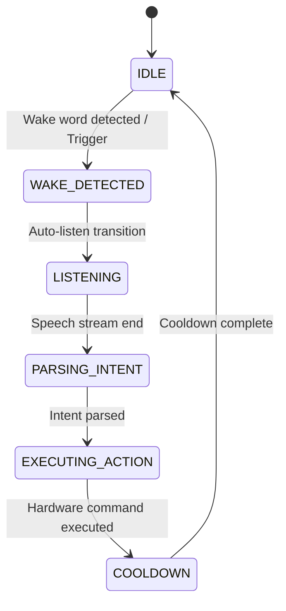

# Edge Perception Pipeline Architecture

## System Overview

The Medical Droid perception subsystem provides offline, on-device situational awareness and interactive voice triggering tailored for Raspberry Pi 4 edge compute. It combines vision (face detection and behavioral cue classification) with audio (energy-based voice activity detection, wake word spotting, and speech recognition).

---

## Subsystem Breakdown

### 1. Vision & Behavioral Cue Engine
- **Face Detector:** Decoupled via `BaseFaceDetector` supporting `MediaPipeFaceDetector` and `MockFaceDetector` fallback.
- **Quantized Inference:** `TFLiteInferenceRunner` handles INT8 quantized models (~7 MB) for edge execution.
- **Temporal Smoothing:** `TemporalSmoother` executes majority voting over an $N$-frame sliding window ($N=5$) to suppress per-frame label jitter.
- **Safety Framing (§7):** Strictly outputs behavioral engagement cues (`engaged`, `distress_flagged`, `neutral`, `absent`), never clinical or emotional diagnoses.

### 2. Audio & Speech Recognition Pipeline
- **Circular Ring Buffer:** `AudioRingBuffer` holds up to 3 seconds of raw 16 kHz mono PCM in memory without allocations during streaming.
- **Energy VAD:** `EnergyVAD` computes Root Mean Square (RMS) signal power to filter out background silence and noise prior to heavier recognition.
- **Wake Word Spotter:** `KeywordSpotter` triggers listening on "Hey Droid", avoiding continuous microphone recording.
- **Offline STT:** `VoskSpeechRecognizer` processes speech locally using Kaldi acoustic models with full mock fallback support.

### 3. Intent Parsing & Dispatching
- **Rule-Based NLP:** `RuleBasedIntentParser` uses regular expressions to match patient and operator commands without cloud LLM dependencies.
- **Intent Dispatcher:** `IntentDispatcher` routes parsed intents to core services:
  - `open_door` / `close_door` $\rightarrow$ `DoorService`
  - `emergency_stop` / `move_stop` $\rightarrow$ `MotorService` and `DoorService`
  - `check_vitals` $\rightarrow$ Telemetry session trigger
  - `call_nurse` $\rightarrow$ Operator assistance alert

---

## REST & WebSocket Integration

| Endpoint | Method | Description |
|---|---|---|
| `/api/v1/perception/status` | GET | Current smoothed vision cue and stability confidence |
| `/api/v1/perception/analyze` | POST | Analyze latest camera frame and broadcast update |
| `/api/v1/perception/stt/transcribe` | POST | Transcribe raw PCM audio or mock phrase |
| `/api/v1/perception/intent/parse` | POST | Parse transcript into structured intent |
| `/api/v1/perception/coordinator/status` | GET | Active lifecycle state and transition history |
| `/api/v1/perception/coordinator/trigger-wake` | POST | Manual wake word trigger |
| `/api/v1/perception/coordinator/execute-command` | POST | End-to-end command parse and dispatch |
| `/api/v1/perception/coordinator/reset` | POST | Reset coordinator state machine to `IDLE` |

All lifecycle transitions and recognized intents broadcast over WebSocket `/ws/state` in real time.
